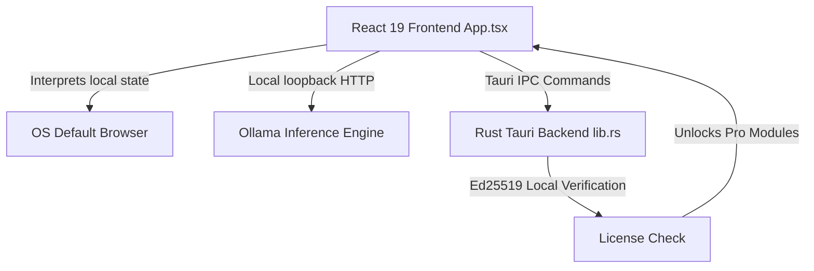

# VERA — MASTER DEVELOPER HANDOFF (v3.0)

**Project State:** Production-Ready (v1.1.4 Shipped & Compiled)  
**Parent Brand:** LexSort Inc.  
**Tech Stack:** React 19 (TypeScript) + Rust (Tauri v2) + Ollama Local HTTP API  

---

## 🧭 1. Architectural Overview & Context

**VERA** is a local-first, private AI assistant built to operate entirely on the user's local machine. The product is designed with a **unified codebase model** where a single binary houses both the VERA Freeware and VERA Pro features.



### Archived Swift/Xcode Mobile Prototype vs. Current Tauri App
- **Archived Context**: The previous mobile prototype (salvaged and archived under `03_ARCHIVED_PRODUCTS/LS_Vera_OLD/`) was an iOS/Xcode project written in Swift using Metal backends (`llama.swift`).
- **Current Desktop App**: The current production version is a multi-platform Tauri application (`lexsort-personal-ai/`) targeting macOS (Apple Silicon + Intel), Windows, and Linux.

---

## 📂 2. Repository & Directory Directory

The workspace is organized into four main layers:

```
Lexsort-personal-ai/
├── lexsort-personal-ai/         # Tauri Desktop Application Shell
│   ├── src/                    # React 19 + TypeScript Frontend code
│   │   ├── App.tsx             # Main chat view, settings, and update handler
│   │   ├── SupportPanel.tsx    # Diagnostic logs, FAQ, and link opening helpers
│   │   └── app.css             # Main styling & layout tokens
│   └── src-tauri/              # Rust Backend & Configurations
│       ├── capabilities/       # Tauri v2 security scopes
│       │   └── default.json    # Whitelisted domain patterns
│       ├── src/lib.rs          # System commands, hardware detection & update checking
│       └── tauri.conf.json     # Tauri builder options & app version manifest
├── website/                    # Static Marketing Website Pages
│   ├── download.html           # Downloader portal with automatic platform detection
│   ├── vera-pro.html           # Pro subscription plans and comparison matrix
│   └── js/download-detector.js # Platform scanner routing users to latest downloads
├── netlify/                    # Serverless Functions (Netlify)
│   └── functions/
│       ├── stripe-webhook.js   # Handles payment events and creates license keys
│       └── uptime-monitor.js   # Automated checks verifying release download binaries
└── discord-bot/                # Discord slash command registration and license helpers
```

---

## 🔒 3. Hardening & Security Implementation (Critical Developer Notes)

### 3.1. Tauri Webview Navigation Sandbox
By default, Tauri v2 sandboxes the webview context and actively blocks standard `<a>` tags with `target="_blank"` from navigating externally. Attempting to click an unhandled hyperlink will either fail silently or raise a security violation inside the webview console.

#### The Interception Fix
To allow users to safely navigate to external pages (like checkout or documentation) without breaking the sandboxed shell:
1. **Reusable Opener Helper**: We exported a helper function `openExternalUrl` inside [SupportPanel.tsx](file:///Users/williamcommu/Desktop/JUST_ME_MEDIA_VAULT/02_ACTIVE_PROJECTS/Lexsort-personal-ai/lexsort-personal-ai/src/SupportPanel.tsx):
   ```typescript
   export async function openExternalUrl(url: string) {
     try {
       const { openUrl } = await import("@tauri-apps/plugin-opener");
       await openUrl(url);
     } catch {
       // Fallback click simulation
       const a = document.createElement("a");
       a.href = url;
       a.target = "_blank";
       a.rel = "noopener noreferrer";
       document.body.appendChild(a);
       a.click();
       document.body.removeChild(a);
     }
   }
   ```
2. **Explicit Interception**: Every external hyperlink (such as the "Upgrade to Pro" link in [App.tsx](file:///Users/williamcommu/Desktop/JUST_ME_MEDIA_VAULT/02_ACTIVE_PROJECTS/Lexsort-personal-ai/lexsort-personal-ai/src/App.tsx)) must intercept default click routing:
   ```tsx
   <a
     href="https://lexsort.com/vera-pro.html"
     onClick={(e) => {
       e.preventDefault();
       openExternalUrl("https://lexsort.com/vera-pro.html");
     }}
     className="pro-preview__upgrade-btn"
   >
     Upgrade to Pro — $5.99 / month
   </a>
   ```

### 3.2. Tauri Security Capability Whitelisting
To permit the `@tauri-apps/plugin-opener` to request external default browser launches, allowed domains must be explicitly defined inside the scopes in [default.json](file:///Users/williamcommu/Desktop/JUST_ME_MEDIA_VAULT/02_ACTIVE_PROJECTS/Lexsort-personal-ai/lexsort-personal-ai/src-tauri/capabilities/default.json):
```json
{
  "permissions": [
    "core:default",
    "opener:default",
    {
      "identifier": "opener:allow-open-url",
      "scope": {
        "allow": [
          { "url": "https://lexsort.com/*" },
          { "url": "https://discord.gg/*" },
          { "url": "https://www.reddit.com/*" },
          { "url": "https://github.com/*" },
          { "url": "https://buy.stripe.com/*" }
        ]
      }
    }
  ]
}
```

---

## 💳 4. Pro Upgrade & Pricing Model

VERA operates on a unified model where Pro features (e.g. *Auto Emailer*, *Guardian Watch*, and *LexSort-GO*) are dynamically unlocked via an offline cryptographic signature check.

### 4.1. Cryptographic License Gate
- **Heuristic**: When a user purchases a subscription, Stripe fires a webhook triggering the creation of a license key.
- **Verification**: The user enters their cryptographic key in the settings panel. The key's Ed25519 signature is verified 100% locally inside the Tauri app against a compiled public key. No external servers are contacted.

### 4.2. Pricing Synchronization Schema
The VERA Pro subscription plan pricing is strictly synchronized across all developer documents, website assets, and in-app views:
- **Monthly plan**: `$5.99 / month`
- **Yearly plan**: `$59.00 / year` (Save 17%)

---

## 🚀 5. Build, Verification & Release Pipeline

### 5.1. Common Commands

Run in development mode:
```bash
cd lexsort-personal-ai
npm run tauri dev
```

Verify the frontend compiles and packages:
```bash
cd lexsort-personal-ai
npm run build
```

Verify the Rust backend check succeeds:
```bash
cd lexsort-personal-ai/src-tauri
cargo check
```

### 5.2. Release Workflows & Version Control
The production release pipeline is managed by GitHub Actions in `.github/workflows/release.yml`.

To release a new version (e.g., `v1.1.4`):
1. **Version Bump**: Update the version metadata inside:
   - [package.json](file:///Users/williamcommu/Desktop/JUST_ME_MEDIA_VAULT/02_ACTIVE_PROJECTS/Lexsort-personal-ai/lexsort-personal-ai/package.json)
   - [tauri.conf.json](file:///Users/williamcommu/Desktop/JUST_ME_MEDIA_VAULT/02_ACTIVE_PROJECTS/Lexsort-personal-ai/lexsort-personal-ai/src-tauri/tauri.conf.json)
   - [Cargo.toml](file:///Users/williamcommu/Desktop/JUST_ME_MEDIA_VAULT/02_ACTIVE_PROJECTS/Lexsort-personal-ai/lexsort-personal-ai/src-tauri/Cargo.toml)
2. **Download Links Sync**: Update the version strings in `website/download.html`, `website/js/download-detector.js`, and `netlify/functions/uptime-monitor.js`.
3. **Commit & Push**: Commit the changes and push to `main`.
4. **Push Git Tag**: Create and push a tag starting with `v*` (e.g. `v1.1.4`):
   ```bash
   git tag v1.1.4
   git push origin v1.1.4
   ```
This automatically triggers the compilation matrix, codesigns/notarizes the macOS package, builds the Windows MSI and Linux AppImage/DEB, and uploads them directly to the corresponding GitHub Release tag.

## 🔄 6. Hybrid Update System (Approve-then-Auto)

VERA uses a custom-built, lightweight hybrid update flow designed to preserve the application's glassmorphic visual style, bypass GitHub API rate limits, and safely launch installers without file-lock collisions.

### 6.1. Update Discovery
- The app checks for updates on launch by calling the `check_for_updates` Tauri command.
- Rather than querying GitHub's API (which enforces a strict rate-limit of 60 requests/hour), it pulls from a global static CDN manifest: `https://lexsort.com/api/manifest.json`.

### 6.2. Background Downloading & Staging
- When an update is available, the settings tab provides an **"Approve & Download"** button.
- Clicking this triggers `approve_core_update(version)`. The Rust backend spawns a Tokio task to download the platform-specific installer (DMG, MSI, or AppImage) from GitHub Releases directly to `~/.lexsort/updates/`.
- Download progress is streamed to React in real-time via the `core_update_progress` event. Once finished, the path is stored in `~/.lexsort/installed.json` under `update_downloaded_path`.

### 6.3. Intercept on Exit (Auto-Install)
- The React frontend registers an `onCloseRequested` intercept listener using Tauri's `getCurrentWindow()` API.
- If a downloaded update is waiting (verified via `get_pending_update_info`), close events are stopped (`event.preventDefault()`) and a custom, frosted-glass modal overlay is displayed.
- The user can choose:
  1. **Install & Restart**: Triggers `launch_installer_and_exit`, which runs the native platform shell command to execute the installer (e.g., `open` on macOS) and exits VERA immediately (`std::process::exit(0)`). Exiting immediately is critical as it drops SQLite and port locks, allowing the installer to run without conflict.
  2. **Later**: Bypasses the intercept flag and closes the app immediately. The update will be detected and prompt again next time the app is launched and exited.
  3. **Cancel**: Dismisses the exit dialog to resume using the app.

## 🧠 7. Zero-Config AI Engine Onboarding (Auto-Install Ollama)

VERA includes a zero-config, portable onboarding system that automatically handles installing and configuring the local AI engine (Ollama) if it is missing from the user's system.

### 7.1. Detection & Priority
- During startup (`bootSequence`), VERA executes `check_engine_installed`.
- The command checks for the `ollama` executable. It checks a local portable path `~/.lexsort/bin/ollama` first, before scanning system candidate folders.
- It executes `ollama --version` to verify the binary is active. If missing, it transitions VERA to `PHASE.ENGINE_SETUP`, halting boot.

### 7.2. Sandboxed Installer Setup
- Clicking "Download & Configure Engine" runs `setup_engine`, spawning a background task to download and configure the platform binary:
  - **macOS**: Downloads `Ollama-darwin.zip`. Spawns system `unzip` command to extract and copy `Ollama.app/Contents/Resources/ollama` to `~/.lexsort/bin/ollama`.
  - **Windows**: Downloads `ollama-windows-amd64.zip` (portable). Spawns `powershell` with `Expand-Archive` to extract `ollama.exe` to `~/.lexsort/bin/ollama`. This runs without UAC prompts.
  - **Linux**: Downloads standalone binary `ollama-linux-amd64` directly to `~/.lexsort/bin/ollama`.
- On macOS and Linux, the backend sets Unix permission mode `0o755` on the copied binary to make it executable.
- Immediately after copying, the downloaded archive and extracted temporary files are deleted to free disk space.

### 7.3. Signature & Retry Resiliency
- The engine download task verifies the signature of the downloaded package against embedded SHA-256 hashes:
  - macOS: `56fd727e2c2cd7388bcb3ad10ea50482bf3f326143a18814d0de38cabd7c08dd`
  - Windows: `a095dce6739c4635e7f4b856c08d1429598d3eae5c632995653f5339e15b5933`
  - Linux: `7641b21e9d0822ba44e494f5ed3d3796d9e9fcdf4dbb66064f8c34c865bbec0b`
- If a hash mismatch or a connection interruption occurs, the downloader retries up to 3 times before returning an error state.

---

## 🔮 8. First-Launch Model Selection Onboarding

VERA includes a comprehensive model selection onboarding system (`PHASE.MODEL_SELECTION`) triggered on first launch when no active model is configured in the backend registry.

### 8.1. Discovery & Local Model Prioritization
- During first launch, VERA queries `list_installed_models` on the backend to detect any previously installed Ollama models.
- If local models are found, they are displayed first in a dedicated "Detected Local Models" section, marked with a green `Local` badge.
- Selecting a detected local model and confirming skips the download phase (`PHASE.DOWNLOADING`) entirely, starting the local inference server and booting directly to the chat.

### 8.2. Dropdown Recommendations & Bandwidth Awareness
- Recommended models from `MODELS_LIST` (e.g., Qwen 2.5 14B, Llama 3.1 8B, Mistral 7B, Llama 3.2 3B, Phi-3 Mini) are presented in a select dropdown, showing their download sizes (e.g., `9.0 GB`) and detailed descriptions.
- This lets users review the bandwidth requirements before triggering a download.

### 8.3. RAM Capacity Warnings & Hard Blocks
- VERA cross-references the selected model's minimum RAM requirement with the system RAM (`hardware.ram_gb`).
- If a remote model's RAM requirement exceeds system capacity, VERA displays a prominent warning block and disables the "Confirm & Download" button to prevent out-of-memory crashes or bandwidth waste.
- If a local model exceeds system RAM, a warning is shown to notify the user of potential lag, but the confirmation action remains enabled, honoring user preference since the model is already downloaded.

### 8.4. Onboarding Skip Option
- Users can choose "Skip Onboarding / Use Lightweight Default" at the bottom of the card.
- This immediately configures `phi3:mini` as the active model and initiates the boot sequence, allowing power users or testers to quickly access the app with minimal setup.

---

## 📋 9. Future Roadmap & Build List

### 9.1. Voice Input & Speech-to-Text (STT) Native Integration
- **Status**: Hidden (feature flag `supported: false` enabled inside `useSpeechRecognition.ts` in both Freeware and Pro repositories).
- **Issue**: Standard browser-level Web Speech API (`webkitSpeechRecognition` / `SpeechRecognition`) triggers a security crash (SIGABRT/SIGKILL) in WKWebView on macOS when running in development mode (`tauri dev`), unless the parent Terminal/IDE has microphone permission.
- **Future Resolution**: Implement a native Rust-based audio capture layer using `cpal` or migrate to a local whisper.cpp model to make speech input robust, offline, and bypass OS browser permission issues.

---
*VERA is a LexSort Inc. project.*  
*All rights reserved.*    
