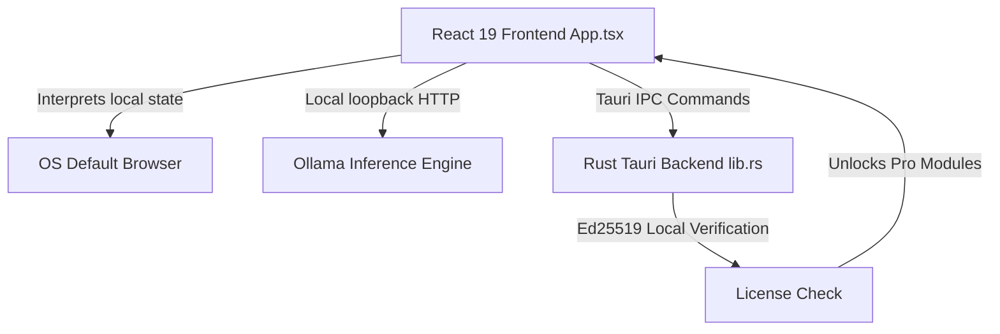

# VERA — MASTER DEVELOPER HANDOFF (v3.0)

**Project State:** Production-Ready (v1.1.2 Shipped & Compiled)  
**Parent Brand:** LexSort Inc.  
**Tech Stack:** React 19 (TypeScript) + Rust (Tauri v2) + Ollama Local HTTP API  

---

## 🧭 1. Architectural Overview & Context

**VERA** is a local-first, private AI assistant built to operate entirely on the user's local machine. The product is designed with a **unified codebase model** where a single binary houses both the VERA Freeware and VERA Pro features.



### Archived Swift/Xcode Mobile Prototype vs. Current Tauri App
- **Archived Context**: The previous mobile prototype (salvaged and archived under `03_ARCHIVED_PRODUCTS/LS_Vera_OLD/`) was an iOS/Xcode project written in Swift using Metal backends (`llama.swift`).
- **Current Desktop App**: The current production version is a multi-platform Tauri application (`lexsort-personal-ai/`) targeting macOS (Apple Silicon + Intel), Windows, and Linux.

---

## 📂 2. Repository & Directory Directory

The workspace is organized into four main layers:

```
Lexsort-personal-ai/
├── lexsort-personal-ai/         # Tauri Desktop Application Shell
│   ├── src/                    # React 19 + TypeScript Frontend code
│   │   ├── App.tsx             # Main chat view, settings, and update handler
│   │   ├── SupportPanel.tsx    # Diagnostic logs, FAQ, and link opening helpers
│   │   └── app.css             # Main styling & layout tokens
│   └── src-tauri/              # Rust Backend & Configurations
│       ├── capabilities/       # Tauri v2 security scopes
│       │   └── default.json    # Whitelisted domain patterns
│       ├── src/lib.rs          # System commands, hardware detection & update checking
│       └── tauri.conf.json     # Tauri builder options & app version manifest
├── website/                    # Static Marketing Website Pages
│   ├── download.html           # Downloader portal with automatic platform detection
│   ├── vera-pro.html           # Pro subscription plans and comparison matrix
│   └── js/download-detector.js # Platform scanner routing users to latest downloads
├── netlify/                    # Serverless Functions (Netlify)
│   └── functions/
│       ├── stripe-webhook.js   # Handles payment events and creates license keys
│       └── uptime-monitor.js   # Automated checks verifying release download binaries
└── discord-bot/                # Discord slash command registration and license helpers
```

---

## 🔒 3. Hardening & Security Implementation (Critical Developer Notes)

### 3.1. Tauri Webview Navigation Sandbox
By default, Tauri v2 sandboxes the webview context and actively blocks standard `<a>` tags with `target="_blank"` from navigating externally. Attempting to click an unhandled hyperlink will either fail silently or raise a security violation inside the webview console.

#### The Interception Fix
To allow users to safely navigate to external pages (like checkout or documentation) without breaking the sandboxed shell:
1. **Reusable Opener Helper**: We exported a helper function `openExternalUrl` inside [SupportPanel.tsx](file:///Users/williamcommu/Desktop/JUST_ME_MEDIA_VAULT/02_ACTIVE_PROJECTS/Lexsort-personal-ai/lexsort-personal-ai/src/SupportPanel.tsx):
   ```typescript
   export async function openExternalUrl(url: string) {
     try {
       const { openUrl } = await import("@tauri-apps/plugin-opener");
       await openUrl(url);
     } catch {
       // Fallback click simulation
       const a = document.createElement("a");
       a.href = url;
       a.target = "_blank";
       a.rel = "noopener noreferrer";
       document.body.appendChild(a);
       a.click();
       document.body.removeChild(a);
     }
   }
   ```
2. **Explicit Interception**: Every external hyperlink (such as the "Upgrade to Pro" link in [App.tsx](file:///Users/williamcommu/Desktop/JUST_ME_MEDIA_VAULT/02_ACTIVE_PROJECTS/Lexsort-personal-ai/lexsort-personal-ai/src/App.tsx)) must intercept default click routing:
   ```tsx
   <a
     href="https://lexsort.com/vera-pro.html"
     onClick={(e) => {
       e.preventDefault();
       openExternalUrl("https://lexsort.com/vera-pro.html");
     }}
     className="pro-preview__upgrade-btn"
   >
     Upgrade to Pro — $5.99 / month
   </a>
   ```

### 3.2. Tauri Security Capability Whitelisting
To permit the `@tauri-apps/plugin-opener` to request external default browser launches, allowed domains must be explicitly defined inside the scopes in [default.json](file:///Users/williamcommu/Desktop/JUST_ME_MEDIA_VAULT/02_ACTIVE_PROJECTS/Lexsort-personal-ai/lexsort-personal-ai/src-tauri/capabilities/default.json):
```json
{
  "permissions": [
    "core:default",
    "opener:default",
    {
      "identifier": "opener:allow-open-url",
      "scope": {
        "allow": [
          { "url": "https://lexsort.com/*" },
          { "url": "https://discord.gg/*" },
          { "url": "https://www.reddit.com/*" },
          { "url": "https://github.com/*" },
          { "url": "https://buy.stripe.com/*" }
        ]
      }
    }
  ]
}
```

---

## 💳 4. Pro Upgrade & Pricing Model

VERA operates on a unified model where Pro features (e.g. *Auto Emailer*, *Guardian Watch*, and *LexSort-GO*) are dynamically unlocked via an offline cryptographic signature check.

### 4.1. Cryptographic License Gate
- **Heuristic**: When a user purchases a subscription, Stripe fires a webhook triggering the creation of a license key.
- **Verification**: The user enters their cryptographic key in the settings panel. The key's Ed25519 signature is verified 100% locally inside the Tauri app against a compiled public key. No external servers are contacted.

### 4.2. Pricing Synchronization Schema
The VERA Pro subscription plan pricing is strictly synchronized across all developer documents, website assets, and in-app views:
- **Monthly plan**: `$5.99 / month`
- **Yearly plan**: `$59.00 / year` (Save 17%)

---

## 🚀 5. Build, Verification & Release Pipeline

### 5.1. Common Commands

Run in development mode:
```bash
cd lexsort-personal-ai
npm run tauri dev
```

Verify the frontend compiles and packages:
```bash
cd lexsort-personal-ai
npm run build
```

Verify the Rust backend check succeeds:
```bash
cd lexsort-personal-ai/src-tauri
cargo check
```

### 5.2. Release Workflows & Version Control
The production release pipeline is managed by GitHub Actions in `.github/workflows/release.yml`.

To release a new version (e.g., `v1.1.2`):
1. **Version Bump**: Update the version metadata inside:
   - [package.json](file:///Users/williamcommu/Desktop/JUST_ME_MEDIA_VAULT/02_ACTIVE_PROJECTS/Lexsort-personal-ai/lexsort-personal-ai/package.json)
   - [tauri.conf.json](file:///Users/williamcommu/Desktop/JUST_ME_MEDIA_VAULT/02_ACTIVE_PROJECTS/Lexsort-personal-ai/lexsort-personal-ai/src-tauri/tauri.conf.json)
2. **Download Links Sync**: Update the version strings in `website/download.html`, `website/js/download-detector.js`, and `netlify/functions/uptime-monitor.js`.
3. **Commit & Push**: Commit the changes and push to `main`.
4. **Push Git Tag**: Create and push a tag starting with `v*` (e.g. `v1.1.2`):
   ```bash
   git tag v1.1.2
   git push origin v1.1.2
   ```
This automatically triggers the compilation matrix, codesigns/notarizes the macOS package, builds the Windows MSI and Linux AppImage/DEB, and uploads them directly to the corresponding GitHub Release tag.

---
*VERA is a LexSort Inc. project.*  
*All rights reserved.*  
