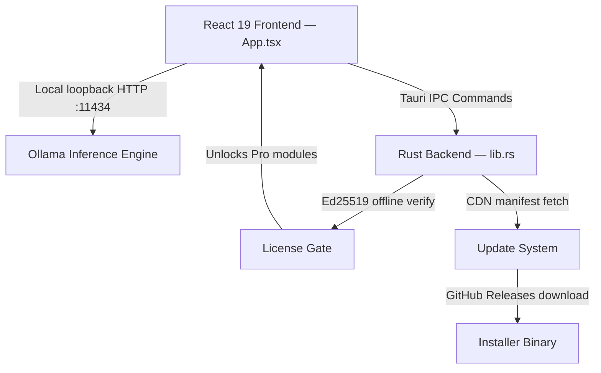

# VERA — Architecture

**Version:** 1.1.5 (Freeware) · 1.0.5 (Pro)

---

## System Overview

VERA is a **local-first, private AI desktop assistant**. Everything runs on-device — no cloud, no account, no telemetry.



### Two Editions, One Architecture

| | VERA Freeware | VERA Pro |
|---|---|---|
| Repo | `Lexsort-personal-ai` (public) | `Lexsort-Vera-Pro` (private) |
| License check | None — free | Ed25519 key + local verify |
| Modules | Chat, Quick Organizer | + ProMailer, Guardian Watch, Research Lab, LexSort-GO |
| Pricing | Free forever | $5.99/mo · $59.00/yr |
| CI | `tauri-apps/tauri-action@v0` | `tauri-apps/tauri-action@v0` |

---

## Freeware Repository Layout

```
Lexsort-personal-ai/
├── lexsort-personal-ai/
│   ├── src/
│   │   ├── App.tsx                   # Main app: chat, settings, update handler
│   │   ├── SupportPanel.tsx          # Diagnostics, FAQ, external link helper
│   │   ├── UpdateStatusIndicator.tsx # Update badge component (header)
│   │   ├── app.css                   # Global styles + design tokens
│   │   ├── components/
│   │   │   ├── QuickOrganizer.tsx    # Built-in task/calendar module
│   │   │   ├── ModuleDrawer.tsx      # Module switcher overlay
│   │   │   └── FeedbackBanner.tsx    # Per-module feedback prompt
│   │   └── hooks/
│   │       └── useSpeechRecognition.ts # STT hook (currently disabled)
│   └── src-tauri/
│       ├── src/lib.rs                # All Tauri commands: hardware, update, AI engine
│       ├── capabilities/default.json # Tauri v2 domain whitelist
│       ├── tauri.conf.json           # Version + bundle config
│       └── Cargo.toml                # Rust dependencies
├── website/
│   ├── api/manifest.json             # Update manifest — bumped per release
│   ├── download.html                 # Download portal (auto platform detect)
│   └── js/download-detector.js       # Routes user to correct binary
├── netlify/
│   └── functions/
│       ├── stripe-webhook.js         # Payment events → license key creation
│       ├── submit-bug-report.js      # Bug report intake
│       └── uptime-monitor.js         # Verifies release binaries are live
└── discord-bot/
    └── tester-manager.js             # /register slash command + role assignment
```

---

## Key Design Decisions

### Local-only AI inference
VERA routes all chat requests to Ollama running on `localhost:11434`. No data ever leaves the machine. VERA does NOT proxy queries through any LexSort servers.

### Unified binary with feature flags
Rather than two separate binaries, both editions share the same Rust codebase. The Pro build includes additional modules locked behind an Ed25519 license check.

### Dynamic module system
Pro modules can be hot-loaded as compiled WebAssembly/JS bundles from the local filesystem. The `LOADED_MODULES` static registry tracks which modules are mounted.

### Historical note — archived Swift prototype
The original mobile prototype (iOS/Xcode, Swift/Metal + `llama.swift`) is archived under `03_ARCHIVED_PRODUCTS/LS_Vera_OLD/`. The current production app is entirely Tauri-based.

---

*See also: [SECURITY.md](SECURITY.md) · [BUILD_AND_RELEASE.md](BUILD_AND_RELEASE.md)*
